+++
title = 'An introduction to Nottui, a terminal user interface library for OCaml'
date = 2024-07-17T08:44:42+10:00
draft = true
+++

# How I ended up here:

I recently decided to make my first TUI (Terminal User Interface) application. I wanted a better way to interact with the [jujutsu version control system](https://github.com/martinvonz/jj?tab=readme-ov-file), and I was used to working with lovely tools like [Lazygit](https://github.com/jesseduffield/lazygit), so making a TUI seemed like the obvious solution. 
However, I was immediately faced with a choice: Which language?
- Rust has [ratatui](https://github.com/ratatui-org/ratatui), which has a proven track record, but Rust's slow compile times and borrow checker make it less ideal for quick prototyping - something vital for an experimental application.
- Go has [Bubbletea](https://github.com/charmbracelet/bubbletea), which seems extremely well-supported, but go doesn't have enums, let alone a proper tagged union type, which I believe are often the most natural way to model the kind of data needed in user interfaces.
- OCaml boasts super-fast compile times, is excellent for prototyping, and features an expressive type system.

OCaml seems perfect, but does it have a TUI library?

Well yes, two, actually 

## [Nottui](https://github.com/let-def/lwd)
Almost no documentation, half finished widget library, very little activity in the last few years, only like 3 applications made with it.  

## [MintTea](https://github.com/leostera/minttea)
Brand new, latest version isn't on opam, no examples of real applications built with it, the example project used 80% of my CPU displaying some text.

**Nottui it is!**

# Nottui

So I learned Nottui from scratch. Muddling my way through mysterious single letter variable names and undocumented widgets mostly using trial and error and reading the source code.

And it turns out, it's great!

Now if you stick around, you won't have to suffer like I did, to understand it. 

## So what even is Nottui?

Nottui is fundamentally:
- **Notty**, a Terminal rendering library (This provides primitives for rendering)
- **Lwd**, an incremental computation library (This provides reactivity)
- **Nottui**, A UI layout system (This lets you specify "this box goes next to this other box")

Hopefully by the end of this you'll understand all three enough to make lovely TUIs of your own 

## Lwd: Reactivity

Lwd is a library for building self-adjusting computations. It is similar to a system called [Incremental](https://github.com/janestreet/incremental) made by Jane Street ([video overview here](https://www.youtube.com/watch?v=R3xX37RGJKE)). 
Essentially it is a way for us to make the smallest portion of the UI recompute when something changes.
Imagine we are building a graph where all the leaves are some changeable value and when something changes all the nodes between the changed value and the root will be updated.

If the first image represents our initial graph, the second shows the nodes that are recomputed after the bottom-left `Lwd` node changes.

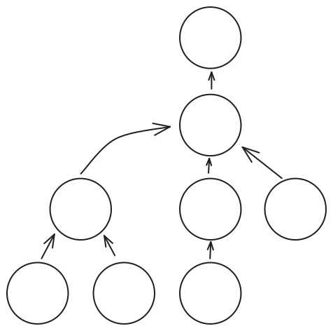
{width="350"}
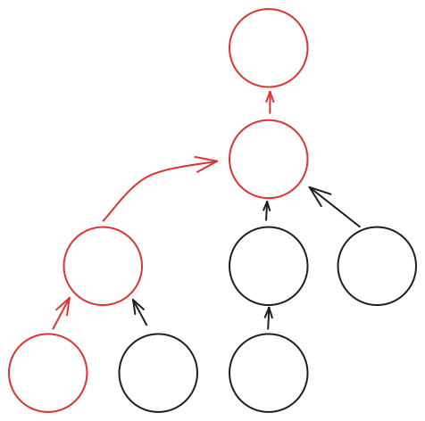
{width="350"}

Hopefully, these examples will help you understand. 
I'm going to include some type annotations for clarity, but they aren't necessary.

### Making a reactive counter
First, let's look at a simple counter:
```OCaml
open Nottui

let button_example =
   let count_var = Lwd.var 0 in
   let counter:ui Lwd.t =
      Lwd.map (Lwd.get count_var) ~f:(fun (count:int Lwd.t) -> count |> string_of_int |> W.string)
   in 
   let button:int Lwd.var =
      W.button "click me!" (fun _ -> Lwd.set count_var (Lwd.peek count_var + 1))
   in
   W.vbox [ counter; button |> Lwd.pure ]
;;

let () = Ui_loop.run ~quit_on_ctrl_q:true button_example
```
If you run this example, you should see a counter like this: 

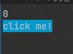

I'll step you through the code, and then we will make some changes to make it much less verbose.

``` OCaml
let button_example =
  let count_var = Lwd.var 0 in
```

First, we are making an `Lwd.var` to store the count. 
This is a bit like a `ref` in normal OCaml, except that other parts of our code can be reactively updated when it changes. In our graph, this would be one of the outer nodes.


``` OCaml
  let counter:ui Lwd.t =
    (Lwd.get count_var) |> Lwd.map ~f:(fun count:int Lwd.t -> count |> string_of_int |> W.string)
    in 
```  

Next, we make the counter text by getting the contents of the `count_var` and then displaying it in a string widget.

`Lwd.get` takes a `'a Lwd.var` and returns a `'a Lwd.t` which will be reactively updated whenever the source `Lwd.var`(count_var) changes.

A `'a Lwd.t` is a reactive value, and in this case, because it came directly from an `Lwd.var` it has no dependencies and will be one of the outermost nodes in our graph.
We use `Lwd.map` to transform the count value (`int Lwd.t`) into a ui widget ( `ui Lwd.t`) showing that count. 
This is adding a node in our lwd graph. The `int` count updating will cause this `ui` to update.

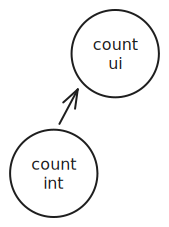

``` OCaml
let button:ui Lwd.t =
   W.button "click me!" (fun _ -> Lwd.set count_var (Lwd.peek count_var + 1))
   in 
```
We make a button that sets the `count_var` in its callback. 

Using`Lwd.peek` instead of `Lwd.get` gets the value of `count_var` non-reactively.
It doesn't make sense to get the value reactively because we are already in a callback that triggers when you press the button, no reactivity is needed.

Also consider, if this had to somehow be added to the lwd graph, what would the graph look like?  

The button callback function would have to be its own `ui lwd.var` which would be recomputed each time the `count_var` changes. That would be wasteful and pointless.
That silly setup would look something like this:

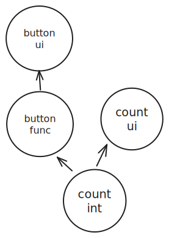

```OCaml
W.vbox [ counter; button |> Lwd.pure ]
```

Lastly, we render our two UI components vertically stacked using a vbox. Because our button is currently just type `ui` and counter is `ui Lwd.t` we need to make the button also `ui Lwd.t`. To do that we pass it to `Lwd.pure` which signifies we want this value to be part of our tree of Lwd nodes, but it isn't reactive. 
Our lwd graph now looks like this:

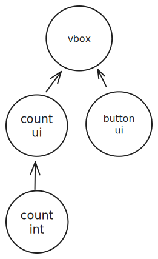

### Review
Let's review what we've learned:

- `Lwd.var:'a->Lwd.var` Makes a variable that can trigger reactive update
- `Lwd.get:'a Lwd.var -> 'a Lwd.t` Gets the value of an `Lwd.var` and will update whenever the var changes 
- `Lwd.set:'a Lwd.var -> 'a -> unit` Sets an `Lwd.var` updating anywhere that it is used with `Lwd.get`
- `Lwd.peek:'a Lwd.var -> 'a` Gets the value of an `Lwd.var` without reactively updating when it changes (mostly useful in callbacks)
- `Lwd.map:'a Lwd.t -> f:('a -> 'b) -> 'b Lwd.t` A mapping from one reactive Lwd state to another  
- `Lwd.pure:'a -> 'a Lwd.t` Turns a value into an Lwd node so it can be composed with other Lwd nodes. 


### Using operators to make code cleaner

Great, we can make reactive ui! But I know what you're thinking: 

> "That's a lot of code for a button!"

So let's address that using some convenience operators:

```OCaml 
open Lwd_infix
let button_example =
  let count_var = Lwd.var 0 in
  let counter =
    let$ count = Lwd.get count_var in
    count |> string_of_int |> W.string
  in

  let button = W.button "click me!" (fun _ -> count_var $= Lwd.peek count_var + 1) in
  W.vbox [ counter; button |> Lwd.pure ]
;;
```
That looks a way more like normal ocaml code!

`Lwd_infix` provides a collection of operators for common activities.
Such as:
- `$=` for setting `Lwd.var`s
- `let$` and `and$` which replace `Lwd.map` and `Lwd.map2`, `Lwd.map3`... etc. You can read more about monadic let operators [here](https://OCaml.org/manual/5.2/bindingops.html).
- `|>$` for piping a `'a Lwd.t` into a function with the signature `'a->'b`. This is useful if you have a function like `Ui.resize` that takes a `ui` and you currently have a `ui Lwd.t` for example. 

I hope that provides an overview of how reactivity works, I'll provide a more thorough explanation with performance in mind in a later chapter.

## Notty: Rendering

Notty provides the primitives for rendering and styling text in the terminal.
Nottui converts those styled text elements into UI elements that can be placed next to, or ontop of other elements, stretch and squash to fill free space, have focus, and dynamically update.

Mostly you won't have to use Notty directly because Nottui already has widgets for most things.

If you do have to get low-level though:
Notty can render strings and unicode characters:
```ocaml
open Notty
(*we can turn some sequence of characters into text*)
let text = I.string A.empty "Hello world"
(*unicode symbols*)
let unicode =I.uchar A.empty (Uchar.of_int 0x25cf) 1 1
```
Notty can do stying:
```ocaml
let blue= I.string A.(fg blue) "blue"
let blue= I.string A.((fg blue)++(bg blue)++(st bold)) "blue"
```
We turn a Notty `image` into a Nottui `ui` like so:
```ocaml
let blue_ui = Ui.atom blue 
```
I'm not going to detail about Notty because it is pretty well documented and not something you're likely to use directly too much, but I thought it best to at least touch upon it.

## Nottui: Layout

Next on the agenda is layout.
To simplify things, I will only discuss width, just remember all the same rules apply to height. 
Every `ui` element has 3 variables controlling its rendered width:
- `w`(width)- The width of the element. This is automatically set based on the content and controls either its rendered width, or the minimum width (when stretch width is also set) 
- `sw`(stretch width)- The priority of this element compared to others when stretching to fill free space.
- `mw`(max width)- The maximum width of the element. Useful if you want some ui to stretch and squash, but not take up more space than its content.

I know, stretch width sounds weird, I'll explain shortly.

### Some examples:

First up, we are going to make a style so we can see our two elements easier:
```OCaml
let layout_examples=
  let attr= A.fg A.blue in
```

#### Width

```OCaml
  let elem = Ui.hcat [ W.string ~attr "hi"; W.string "there" ] in
```


Elem has `w=7,sw=0`. That's because `"hi"` has `w=2,sw=0` and `"there"` has `w=5,sw=0`. Everything always defaults to an `sw` of `0`.

#### Stretching

```OCaml
  let elem_sw0 =Ui.hcat [ W.string ~attr "hi" |> Ui.resize ~mw:1000 ~sw:1; W.string "there" ] in
```
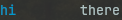

Elem now has `w=7,sw=1,mw=1000`. By setting `sw:1` we allow the element to stretch, and `mw:1000` just makes the max width essentially infinite. As you can see, "hi" has filled all the available space. An element's stretch width is the sum of its children just like its width, so the `Ui.hcat` elem has `sw:1` too.

```OCaml
  let elem_sw1 = Ui.hcat [
     W.string ~attr "hi" |> Ui.resize ~mw:1000 ~sw:1;
     W.string "there" |> Ui.resize ~mw:1000 ~sw:2
    ]
  in
```
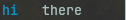

Now we have allowed `"there"` to stretch too. See how `"there"` taking up 2/3 of the available space while `"hi"` takes up `1/3`. That's because the sum of the two elements `sw` is `3` the space is divided up into 3 portions, 2 of which go to `"there"` with one for `"hi"` 
#### Minimum width

```OCaml
  let elem_w = Ui.hcat [
     W.string ~attr "1234567890abcd" |> Ui.resize ~w:10 ~sw:1;
     W.string "there" |> Ui.resize ~sw:1
    ]
  in
```
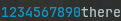

Elements by default have a width the same as their content. When stretching and squashing `w` sets the minimum size an element can be.
Here, we set the minimum size of our first element to `w:10` we see it shrinks to fit `"there"`in our space.  
#### Maximum width

```OCaml
  let elem_mw = Ui.hcat [
    W.string ~attr "1234567890abcd" |> Ui.resize ~w:5 ~sw:1 ~mw:7
    W.string "there" |> Ui.resize ~sw:2
   ]
  in
```
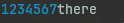

By setting the max width we can prevent the element from expanding beyond a set size, here it's 7 characters.
### Summary:

I'll render these all in a vertical stack,
limit the space so we can see the effects of our min and max widths.
Lastly, put a border around the whole thing.

```OCaml
  Ui.vcat [ elem; elem_sw0; elem_sw1; elem_w; elem_mw ]
  |> Ui.resize ~w:15 ~sw:0
  |> Lwd.pure
  |> W.Box.border ~pad_w:0 ~pad_h:0
```
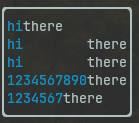
## Focus

Focus is a how we control which elements receive keyboard events.

### Some key ideas of focus:

We will make a little test to show the use of focus
```OCaml
  let output = Lwd.var "none" in
(**)
   let output = Lwd.var "none" in
   (*A button that responds to the enter keypress*)
   let button ?(focus = Focus.make ()) name =
     let$ focus = focus |> Focus.status in
     W.string name
     |> Ui.keyboard_area ~focus (function
       | `Enter, _ ->
         output $= "inner";
         `Handled
       | _ ->
         `Unhandled)
   in
   let outerFocus = Focus.make () in

   (*We wrap the button in some more UI*)
   let$ outer = W.vbox [ button "I'm a button"; Lwd.get output |>$ W.string ]
   and$ focus = Focus.status outerFocus in
   outer
   (*We also give the outer UI respond the "Enter" keypress*)
   |> Ui.keyboard_area ~focus (function
     | `Enter, _ ->
       output $= "outer";
       `Handled
     | _ ->
       `Unhandled)
```

#### UI elements receive keyboard events bottom up, not top down.

If we run that test and press `Enter` we see `none` change to `inner` indicating that the inner button received the event, not the outer UI element.
This is a useful property, imagine if you start editing a text field in a form, you want that field to capture all input until you are finished.

### Focus handle

A focus handle is used to  reactively update the focus of elements . It's similar to an  `Lwd.var` under the hood.
Mostly you will get the status of the handle using `Focus.status`, this is akin to `Lwd.get` because it takes the handle and returns an `Lwd.t`
``` OCaml 
val status : handle -> status Lwd.t
(** Get the status of a focus [handle]. The [status] is a reactive value:
     it will evolve over time, as focus is received or lost. *)
```
Then you can use the handle to make some ui react to being focused. If input is involved, that status can be passed to a `keyboard_area`, as we see in our example.
``` OCaml
(*...*)
let$ focus = focus |> Focus.status in
W.string name
|> Ui.keyboard_area ~focus (function
(*...*)keyboard_area
```

### Focus manager 

I have an improvement to focus that allows focus to return to the previously focused item when `Focus.release` is called. 
This can be found under `FocusManager` but it's not quite battle tested yet, so I'm not going to go into the specifics. 
I'm mentioning it just in case you encounter that problem, if so, see what state it's in at the time. 

### Keyboard areas

Let's go into a little more detail about keyboard areas
```OCaml
val keyboard_area : ?focus:Focus.status -> (key -> may_handle) -> t -> t
(** Define a focus receiver, handle keyboard events over the focused area.
 Distinct from [event_filter] because [`Focus *] events will move focus between these areas *)
```

Some general notes on using keyboard areas:
- Each keyboard_area represents a "focus scope", when it's focused it will receive keypresses.
- if a ui object wrapped in a keyboard_area contains another keyboard_area the parent will also be focused when the child is focused.
-  By default, `Alt+ Arrow` moves focus in any direction, but you can also emit your own focus events on  other key-presses.
- Focus movement events will only move the focus between keyboard areas within the current keyboard area.
  This means if the focus enters a keyboard area, that contains sub keyboard_areas it will be trapped until it is either released or manually requested to go elsewhere.
- The most nested keyboard area receives keys first

## Conclusion:

Well, That concludes chapter 1. 
Hopefully that gives you a good conceptual understanding of Nottui basics. I'll likely write another chapter, at a later date, including some more examples and maybe a few more advanced topics.
This was very dense, I know, so I've also written a more simple piece outlining [making a really simple TUI application](https://github.com/faldor20/nottui/tutorial/nottui/tutorial.md) for a beginner tutorial.
If you are interested in using nottui, I'd suggest starting there or the [examples](https://github.com/faldor20/nottui/examples)

