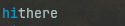

+++
title = 'An introduction to Nottui, a terminal user interface library for ocaml'
date = 2024-07-17T08:44:42+10:00
draft = true
+++


# How I ended up here:

I recently decided to make my first TUI (Terminal User Interface) application. I wanted a better way to interact with the [jujutsu version control system](https://github.com/martinvonz/jj?tab=readme-ov-file), and I was used to working with lovely tools like [Lazygit](https://github.com/jesseduffield/lazygit), so making a TUI seemed like the obvious solution. 
However I was immediately faced with a choice. What langauge?
- Rust has [ratatui](https://github.com/ratatui-org/ratatui), which seems good to use, but rust has slow compile times and is not ideal for quick prototyping, two features I want in a quick "throw it together" application.
- Go has [Bubbletea](https://github.com/charmbracelet/bubbletea), which seems extremely well supported, but go doesn't have an kind of enums let alone a proper tagged union type. I think the kind of data I would need in user interfaces is certainly best modeled with tagged unions.
- Ocaml has super fast compile times, is easy for prototyping, and has an expressive type system.

SO Ocaml seems perfect, but does it have a TUI library?

Well yes, two actually. 

## [Nottui](https://github.com/let-def/lwd)
Almost no documentation, half finished widget library, no activity in years, only like 3 of applications made with it.  

## [MintTea](https://github.com/leostera/minttea)
Brand new, latest version isn't on opam, no examples of real applications built with it, the example project used 80% of my cpu displaying some text.

**Nottui it is!**

# Nottui

So I learned Nottui from scratch. Muddling my way through trial and error and mysterious single letter variable names.

And it turns out, it was great!

Now stick around and you won't have to suffer, like I did, to understand that. 

## So what even is Nottui?

Nottui is fundimentally:
- **Notty**, a Terminal rendering library (This provides primatives for rendering ")
- **Lwd**, an incremental computation library (This provides reactivity)
- **Nottui**, A UI layout system (This lets you specify "this box goes next to this other box")
  These three components are combined in Nottui and hopefully by then end of this you will understand them all enough to make lovely TUIs of you own 

## Lwd: Reactivity

Lwd is a library for building self adjusting computations. It is simmilar to a system called [Incremental](https://github.com/janestreet/incremental) made by janestreet ([video overview here](https://www.youtube.com/watch?v=R3xX37RGJKE)). 
Essentially it is a way for us to make the smallest portion of the ui recompute when something changes.
Imagine we are building a graph where all the leaves are some changeable value and when something changes all the nodes between the changed value and the root will be updated.

If the first image represents our initial graph, the second shows the nodes that are recomputed after the bottom left `Lwd` node changes.


Hopefully these examples will help you understand.
  (I'm going to include some type annotations for clarity)

First lets look at a simple counter:
```ocaml
open Nottui

let button_example =
   let count_var = Lwd.var 0 in
   let counter:ui Lwd.t =
      Lwd.map (Lwd.get count_var) ~f:(fun (count:int Lwd.t) -> count |> string_of_int |> W.string)
   in 
   let button:int Lwd.var =
      W.button "click me!" (fun _ -> Lwd.set count_var (Lwd.peek count_var + 1))
   in
   W.vbox [ counter; button |> Lwd.pure ]
;;

let () = Ui_loop.run ~quit_on_ctrl_q:true button_example
```
If you run this example you should see a counter like this: [image](./assets/counter.png)

I'll step you through the code and then we will make some changes to make it much less verbose.

``` ocaml
let button_example =
  let count_var = Lwd.var 0 in
```

First we are making an `Lwd.var` to store the count. 
This is a bit like a `ref` in normal ocaml, except that other parts of our code can be reactively updated when it changes. In our graph this would be one of the outer nodes.


``` ocaml
  let counter:ui Lwd.t =
    (Lwd.get count_var) |> Lwd.map ~f:(fun count:int Lwd.t -> count |> string_of_int |> W.string)
    in 
```  

Next we make the counter text by getting the contents of the `count_var` and then displaying it in a string widget.

`Lwd.get` takes an `'a Lwd.var` and returns a `'a Lwd.t` which will be reactively updated whenever the source `Lwd.var`(count_var) changes.
A `'a Lwd.t` is a reactive value, and in this case, becasue it came directly from an `Lwd.var` it has no dependencies and will be one of the outer most nodes in our graph.
We use `Lwd.map` to transform the count value (`int Lwd.t`) into a ui widget ( `ui Lwd.t`) which we can render. 
Imagine this is adding a node in our graph. The `int` count updating will cause this `ui` to update.


``` ocaml
let button:ui Lwd.t =
   W.button "click me!" (fun _ -> Lwd.set count_var (Lwd.peek count_var + 1))
   in 
```
We make a button that sets the `count_var` in its callback. Using`Lwd.peek` instead of `Lwd.get` gets the value of `count_var` non-reactively.
It doesn't make sense to get the value reactively because we are already in a callback that triggers when you press the button, no reactivity is needed.  
Also consider, if this had to somehow be added to the lwd graph, what would the graph look like? The button callback function would have to be it's own `ui lwd.var` which would be recomputed each time the `count_var` changes. That would be wasteful and pointless.
That silly setup would look something like this:


```ocaml
W.vbox [ counter; button |> Lwd.pure ]
```

Lastly we render our two Ui components vertically stacked using a vbox. Becasue our button is currently just type `ui` and counter is `ui Lwd.t` we need to make the button also `ui Lwd.t`. To do that we pass it to `Lwd.pure` which signifies we want this value to be part of our tree of Lwd nodes but it isn't reactive. 
Our lwd graph now looks like this 


Lets review what we've learned:

- `Lwd.var:'a->Lwd.var` Makes a variable that can trigger reactive update
- `Lwd.get:'a Lwd.var -> 'a Lwd.t` Gets the value of an `Lwd.var` and will update whever the var changes 
- `Lwd.set:'a Lwd.var -> 'a -> unit` Sets an lwd_var updating anywhere that is getting it
- `Lwd.peek:'a Lwd.var -> 'a` Gets the value of an `Lwd.var` without reactively updating when it changes (very useful in callbacks)
- `Lwd.map:'a Lwd.t -> f:('a -> 'b) -> 'b Lwd.t` A mapping from one reactive Lwd state to another  
- `Lwd.pure:'a -> 'a Lwd.t` Turns a value into an Lwd node so it can be composed with other Lwd nodes. 

Great! But i know what you're thinking: 
> "That's a lot of code for a button!"

So lets address that using some convinence operators:
```ocaml 
open Lwd_infix
let button_example =
  let count_var = Lwd.var 0 in
  let counter =
    let$ count = Lwd.get count_var in
    count |> string_of_int |> W.string
  in

  let button = W.button "click me!" (fun _ -> count_var $= Lwd.peek count_var + 1) in
  W.vbox [ counter; button |> Lwd.pure ]
;;
```
That looks a bit more familiar. `Lwd_infix` provides a collection of operators for common activities.
Such as:
`$=` for setting `Lwd.var`s
`let$` and `and$` which replace `Lwd.map` and `Lwd.map2`, `Lwd.map3`.. etc. You can read more about monadic let [here](#TODO link to monadic let socaml docs)

I hope that provides an overview of how reactivity works I'll provide a more thoughrough explanation with performance in mind in a later chapter #TODO:LINK

## Layout

Next on the agenda is layout.
To simplify things I will only discuss width, just remeber all the same rules apply to height. 
Every `ui` element has two variables controlling its width:
- `w`- The width of the element. This is automatically set based on the content and controls either its rendered width, or the minimum width (when stretch width is also set) 
- `sw` width)- The weighting this element has when stretching to fill available space.
- `mw` width)- The maximum width of the element. Useful if you want stretch and squash but not take up more space than the content of the element.

I know, stretch width sounds weird, I'll expalain shortly.

### Some examples:

First we are going to make a style so we can see our two elements easier:
```ocaml
let layout_examples=
   let attr= A.fg A.blue in
```


#### Width

```ocaml
let elem = Ui.hcat [ W.string ~attr "hi"; W.string "there" ] in
```


Elem has `w=7,sw=0` that's becasue `"hi"` has `w=2,sw=0` and `"there"` has `w=5,sw=0`. Everything always defaults to an `sw` of `0` .

#### Stretching

```ocaml
let elem_sw0 =Ui.hcat [ W.string ~attr "hi" |> Ui.resize ~mw:1000 ~sw:1; W.string "there" ] in
```


Elem now has `w=7,sw=1,mw=1000`, by setting `sw:1` we allow the element to stretch, and `mw:1000` just makes the max width essentially infinite. As you can see "hi" has filled all the available space. An element's stretch width is the sum of its children just like its width, so the Ui.hcat elem has `sw:1` too.
```ocaml
  let elem_sw1 = Ui.hcat [
     W.string ~attr "hi" |> Ui.resize ~mw:1000 ~sw:1;
     W.string "there" |> Ui.resize ~mw:1000 ~sw:2
    ]
  in
```


Now we have allowed `"there"` to stretch too. See how `"there"` taking up 2/3 of the avaiable space while `"hi"` takes up `1/3`. That's because the sum of the two elements `sw` is `3` the space is divided up into 3 portions 2 of which go to `"there"` with one for `"hi"` 


#### Minimum width

```ocaml
  let elem_w = Ui.hcat [
     W.string ~attr "1234567890abcd" |> Ui.resize ~w:10 ~sw:1;
     W.string "there" |> Ui.resize ~sw:1
    ]
  in
```


Elements by default have a width the same as their content, when stretching and squashing `w` sets the minimum size an element can be.
Here we set the minimum size of our first element to `w:10` we see it shrinks to fit `"there"`in our space.  


#### Maximum width

```ocaml
let elem_mw = Ui.hcat [
   W.string ~attr "1234567890abcd" |> Ui.resize ~w:5 ~sw:1 ~mw:7
   W.string "there" |> Ui.resize ~sw:2
  ]
in
```


By setting the max width we can prevent the element from expanding beyond a set size here it's 7 characters.


### Summary:

I'll render these all in a vertical stack,
limit the space so we can see the effects of our min an max widths.
and put a border around the whole thing.

```ocaml
Ui.vcat [ elem; elem_sw0; elem_sw1; elem_w; elem_mw ]
|> Ui.resize ~w:15 ~sw:0
|> Lwd.pure
|> W.Box.border ~pad_w:0 ~pad_h:0
```


## Focus

Focus is a how we control which elements recieve keyboard events.

### Some key ideas of focus:

We will make a little test to show the use of focus
```ocaml
  let output = Lwd.var "none" in
(**)
   let output = Lwd.var "none" in
   (*A button that responds to the enter keypress*)
   let button ?(focus = Focus.make ()) name =
     let$ focus = focus |> Focus.status in
     W.string name
     |> Ui.keyboard_area ~focus (function
       | `Enter, _ ->
         output $= "inner";
         `Handled
       | _ ->
         `Unhandled)
   in
   let outerFocus = Focus.make () in

   (*We wrap the button in some more UI*)
   let$ outer = W.vbox [ button "I'm a button"; Lwd.get output |>$ W.string ]
   and$ focus = Focus.status outerFocus in
   outer
   (*We also give the outer UI respond the "Enter" keypress*)
   |> Ui.keyboard_area ~focus (function
     | `Enter, _ ->
       output $= "outer";
       `Handled
     | _ ->
       `Unhandled)
```

#### UI elements recieve keyboard events bottom up, not top down.

If we run that test and press `Enter` we see `none` change to `inner` indicating that the inner button recieved the event not the outer UI element.
This is a useful property, imagine if you start editing a text field in a form, you want that field to capture all input until you are finished.


### Focus handle

A focus handle is just an lwd var under the hood. It's how you can reactively update the focus of elements. 
Mostly you will get the status of the handle using `Focus.status`
``` ocaml 
val status : handle -> status Lwd.t
(** Get the status of a focus [handle]. The [status] is a reactive value:
     it will evolve over time, as focus is received or lost. *)
```
and then use that to make some ui react to being focused, If input is involved that status can be passed to a `keyboard_area`, as we seen in our example 
``` ocaml
(*...*)
et$ focus = focus |> Focus.status in
.string name
> Ui.keyboard_area ~focus (function
*...*)
```
but we could just as easily call `Focus.has_focus` and turn our text bright blue when it's focused

### Focus manager 

I have an improvement to focus that allows focus to return to the previously focused item when `Focus.release` is called. 
This can be found under `FocusManager` but it's not quite battle tested yet so I'm not going to go into the specifics. 
I'm mentioning it just incase you encounter that problem, if so see what state it's in at the time. 

### Keyboard areas

Lets go into a little more detail about keyboard areas
```ocaml
val keyboard_area : ?focus:Focus.status -> (key -> may_handle) -> t -> t
(** Define a focus receiver, handle keyboard events over the focused area.
 Distinct from [event_filter] because [`Focus *] events will move focus between these areas *)
```

- ``Focus *` events will move the focus between keyboard areas within the current keyboard area.
  this means if the focus enters a keyboard area it will be trapped untill it is either released or moved elsewhere.
- By default `Alt+ Arrow` moves focus in any direction, but you can also emit your own focus events.
- The most nested keyboard area recieves keys first


## Conclusion:

Well That concludes chapter 1. 
Hopefully that gives you a good conceptual understanding of Nottui basics. I'll likely write another chapter, at a later date, including some more examples and maybe a few more advanced topics.
This was very dense I know, so I've also written a more simple piece outlining [making a really simple TUI application](https://github.com/faldor20/nottui/tutorial/nottui/tutorial.md) for a beginner tutorial.
If you are interested in using nottui, I'd suggest starting there or the [examples](https://github.com/faldor20/nottui/examples)
